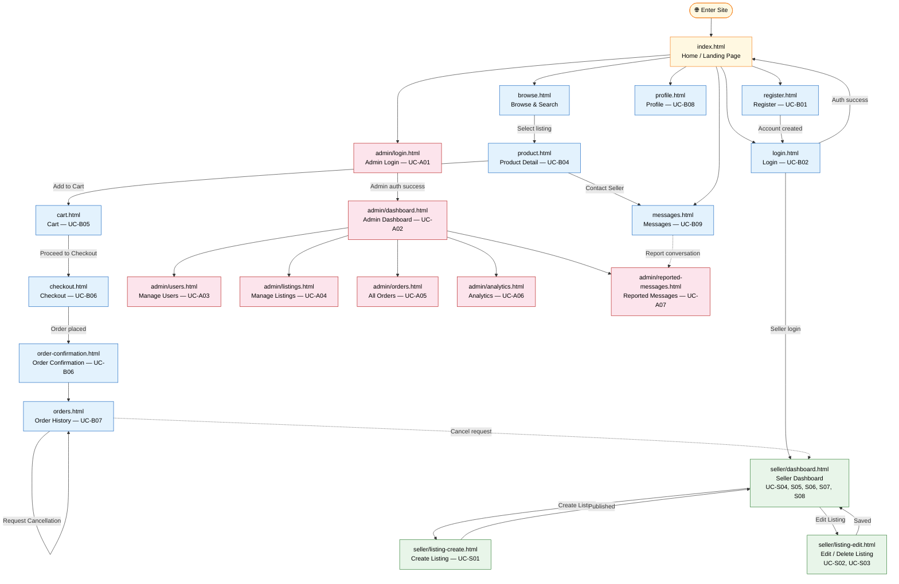

# Campus Marketplace — Use Case Mapping & Web Flow

**CPTS 489 · WSU · Spring 2026**

---

## Table of Contents

1. [File Structure](#file-structure)
2. [Web Flow Diagram](#web-flow-diagram)
3. [Buyer Use Cases (UC-B01 – UC-B10)](#buyer-use-cases)
4. [Seller Use Cases (UC-S01 – UC-S08)](#seller-use-cases)
5. [Admin Use Cases (UC-A01 – UC-A07)](#admin-use-cases)
6. [Navigation Cross-Reference](#navigation-cross-reference)

---

## File Structure

```
campus-marketplace/
├── assets/
│   ├── css/
│   │   └── styles.css               # Shared WSU-themed stylesheet (cm- prefix)
│   └── js/
│       └── app.js                   # Shared JavaScript (Cart, Toast, Modal, Validator, etc.)
│
├── index.html                       # Home / Landing Page
├── register.html                    # UC-B01 · Register / Create Account
├── login.html                       # UC-B02 · Login
├── browse.html                      # UC-B03 · Browse & Search Listings
├── product.html                     # UC-B04 · View Product Details
├── cart.html                        # UC-B05 · Add to Cart / View Cart
├── checkout.html                    # UC-B06 · Checkout
├── order-confirmation.html          # UC-B06 · Order Confirmation (post-checkout)
├── orders.html                      # UC-B07 · View Order History · UC-B10 · Cancel Request
├── profile.html                     # UC-B08 · Manage Profile
├── messages.html                    # UC-B09 · Contact Seller / Messaging
│
├── seller/
│   ├── dashboard.html               # UC-S04 · Seller Dashboard · UC-S05 · View Orders
│   │                                # UC-S06 · Mark Fulfilled · UC-S07 · Messages
│   │                                # UC-S08 · Approve/Deny Cancellation
│   ├── listing-create.html          # UC-S01 · Create Listing
│   └── listing-edit.html            # UC-S02 · Edit Listing · UC-S03 · Delete/Deactivate
│
├── admin/
│   ├── login.html                   # UC-A01 · Admin Login
│   ├── dashboard.html               # UC-A02 · Admin Dashboard Overview
│   ├── users.html                   # UC-A03 · Manage Users (Suspend / Reinstate)
│   ├── listings.html                # UC-A04 · Manage Listings (Remove / Restore)
│   ├── orders.html                  # UC-A05 · View All Orders
│   ├── analytics.html               # UC-A06 · View Platform Analytics
│   └── reported-messages.html       # UC-A07 · Review Reported Messages
│
└── docs/
    └── use-case-mapping.md          # This document
```

---

## Web Flow Diagram



### ASCII Web Flow (plain text fallback)

```
[User Visits Site]
        │
        ▼
  ┌───────────────────────────────────────────────────┐
  │              index.html  (Home)                   │
  └───────────────────────────────────────────────────┘
       │              │              │             │
       ▼              ▼              ▼             ▼
  register.html   login.html   browse.html   admin/login.html
  (UC-B01)       (UC-B02)      (UC-B03)       (UC-A01)
       │              │              │             │
       └──────────────┘              │             ▼
               │                    │       admin/dashboard.html
               ▼                    ▼             (UC-A02)
           [Logged In]         product.html    ┌──────────────┐
               │               (UC-B04)        │ users.html   │
     ┌─────────┴─────────┐        │           │ listings.html│
     │                   │        ▼           │ orders.html  │
     ▼                   ▼   cart.html        │ analytics.html│
 seller/               profile.html (UC-B05)  │ reported-    │
 dashboard.html        (UC-B08)     │         │ messages.html │
 (UC-S04..S08)              │      ▼          └──────────────┘
     │              messages.html checkout.html  (UC-A03..A07)
     ├─ listing-    (UC-B09)    (UC-B06)
     │  create.html    │           │
     │  (UC-S01)       │           ▼
     │                 │    order-confirmation.html
     └─ listing-       │    (UC-B06 post-condition)
        edit.html       │           │
        (UC-S02,S03)   │           ▼
                        │      orders.html
                        │      (UC-B07, UC-B10)
                        │           │
                        └───────────┘
                    (UC-B09 ↔ UC-S07 messaging is bidirectional)
```

---

## Buyer Use Cases

| UC ID  | Name                    | Actor   | Page File                 | Screen Description                                                  |
|--------|-------------------------|---------|---------------------------|---------------------------------------------------------------------|
| UC-B01 | Register Account        | Buyer   | `register.html`           | New user registration form with WSU email validation               |
| UC-B02 | Login                   | Buyer   | `login.html`              | Email + password login with forgot-password modal                  |
| UC-B03 | Browse & Search         | Buyer   | `browse.html`             | Keyword search + category/condition/price filters, paginated grid  |
| UC-B04 | View Product Details    | Buyer   | `product.html`            | Full listing detail: gallery, description, seller info             |
| UC-B05 | Add to Cart / View Cart | Buyer   | `product.html` → `cart.html` | Add button on product page; cart page with item list and totals |
| UC-B06 | Checkout & Confirmation | Buyer   | `checkout.html` → `order-confirmation.html` | Pickup/shipping info, order ID, post-order summary |
| UC-B07 | View Order History      | Buyer   | `orders.html`             | Filterable order table with status badges and order detail modal   |
| UC-B08 | Manage Profile          | Buyer   | `profile.html`            | Edit name, email, phone, bio; change password; notification prefs  |
| UC-B09 | Contact Seller          | Buyer   | `messages.html`           | Real-time-style chat UI with conversation list and send input      |
| UC-B10 | Request Cancellation    | Buyer   | `orders.html`             | Cancel modal on Pending orders; duplicate request blocked          |

### Buyer UC Flow Details

#### UC-B01 — Register Account (`register.html`)
| Flow | Description |
|------|-------------|
| Main | Enter name, WSU email (`@wsu.edu`/`@email.wsu.edu`/`@vet.wsu.edu`), password (≥8 chars), confirm password, accept terms → account created |
| AF1  | Already have an account → "Sign In" link navigates to `login.html` |
| EF1  | Non-WSU email domain → "Must be a valid WSU email address" error |
| EF2  | Password too short (< 8 chars) → inline validation error |
| EF3  | Passwords do not match → confirm field error |
| EF4  | Missing required fields → field-level validation errors |
| EF5  | Email already registered → alert banner |

#### UC-B02 — Login (`login.html`)
| Flow | Description |
|------|-------------|
| Main | Enter WSU email + password → authenticated → redirect to marketplace |
| AF1  | Forgot password → modal with email field → "Reset link sent" toast |
| EF1  | Invalid credentials → error alert |
| EF2  | Suspended account → suspended account alert banner |
| EF3  | Missing fields → field-level validation |

#### UC-B03 — Browse & Search (`browse.html`)
| Flow | Description |
|------|-------------|
| Main | Keyword search bar + sidebar filters (category, condition, price range, course #, sort) → filtered product grid |
| AF1  | No search term → browse all listings |
| AF2  | Change category filter → grid updates |
| EF1  | No results → "No listings match your search" empty state |

#### UC-B04 — View Product Details (`product.html`)
| Flow | Description |
|------|-------------|
| Main | View title, price, photos, condition, description, seller info, rating |
| AF1  | Click thumbnail → update main image (simulated) |
| EF1  | Listing no longer available → unavailability alert |

#### UC-B05 — Add to Cart (`product.html` → `cart.html`)
| Flow | Description |
|------|-------------|
| Main | Click "Add to Cart" → toast confirmation → cart badge count updates |
| AF1  | Navigate to cart → view all added items |
| EF1  | Item already sold (race condition) → race-condition alert on cart page |
| EF2  | Attempting to add own listing → own-listing alert |

#### UC-B06 — Checkout (`checkout.html` → `order-confirmation.html`)
| Flow | Description |
|------|-------------|
| Main | Review cart → enter contact info + pickup preference → confirm → generate order ID → clear cart → redirect to confirmation |
| AF1  | Choose shipping (instead of pickup) → shipping address fields appear |
| EF1  | Required fields missing → validation errors |

#### UC-B07 — View Order History (`orders.html`)
| Flow | Description |
|------|-------------|
| Main | View paginated orders table with status badges |
| AF1  | Filter by status (All, Pending, Fulfilled, Cancelled) |
| AF2  | Click "View" → order detail modal with full info |

#### UC-B08 — Manage Profile (`profile.html`)
| Flow | Description |
|------|-------------|
| Main | Update display name, phone, location, bio → save → success toast |
| AF1  | Email shown as read-only with verification note |
| AF2  | Change password: current password + new + confirm → validated inline |
| AF3  | Update notification preferences (checkboxes) |

#### UC-B09 — Contact Seller / Messaging (`messages.html`)
| Flow | Description |
|------|-------------|
| Main | Select conversation → view chat thread → type message → press Enter or Send button |
| AF1  | Existing conversation pre-loaded from listing contact action |
| EF1  | Attempting to send empty message → validation prevents send |
| AF2  | Report conversation → report modal → submit to admin (UC-A07) |

#### UC-B10 — Request Cancellation (`orders.html`)
| Flow | Description |
|------|-------------|
| Main | Click "Request Cancellation" on a Pending order → modal with required reason → submit |
| AF1  | Seller approves → order status → Cancelled |
| AF2  | Seller denies → order remains Pending |
| EF1  | Cancellation already requested → button disabled with tooltip |

---

## Seller Use Cases

| UC ID  | Name                       | Actor  | Page File                          | Screen Description                                               |
|--------|----------------------------|--------|------------------------------------|------------------------------------------------------------------|
| UC-S01 | Create Listing             | Seller | `seller/listing-create.html`       | Full listing form: photos, title, category, condition, price    |
| UC-S02 | Edit Listing               | Seller | `seller/listing-edit.html`         | Pre-populated edit form; update any field                       |
| UC-S03 | Delete / Deactivate        | Seller | `seller/listing-edit.html`         | Deactivate modal (soft) or permanent delete modal               |
| UC-S04 | View Seller Dashboard      | Seller | `seller/dashboard.html` (Overview) | Stats, recent orders, quick actions, tabbed navigation          |
| UC-S05 | View Orders                | Seller | `seller/dashboard.html` (Orders)   | Orders tab: full order table with status badges                 |
| UC-S06 | Mark Order Fulfilled       | Seller | `seller/dashboard.html` (Orders)   | "Mark Fulfilled" button → confirm modal → status update         |
| UC-S07 | Respond to Messages        | Seller | `seller/dashboard.html` (Messages) | Messages tab: conversation list + chat thread with reply input  |
| UC-S08 | Approve/Deny Cancellation  | Seller | `seller/dashboard.html` (Orders)   | Cancel-req row highlighted; Approve/Deny buttons + review modal |

### Seller UC Flow Details

#### UC-S01 — Create Listing (`seller/listing-create.html`)
| Flow | Description |
|------|-------------|
| Main | Upload photos → fill title, category, condition, price, description → Publish Listing → redirect to dashboard |
| AF1  | "Save as Draft" → listing saved without publishing → toast |
| AF2  | "Preview" → simulated preview toast |
| AF3  | Image > 5MB or invalid type → image error alert |
| EF1  | Missing required fields (title, category, price, description) → inline errors |
| EF2  | Price ≤ 0 or non-numeric → "Price must be a positive number" error |

#### UC-S02 — Edit Listing (`seller/listing-edit.html`)
| Flow | Description |
|------|-------------|
| Main | Modify any field → "Save Changes" → validation → success toast |
| AF2  | Update only price or quantity (other fields pre-filled) |
| AF3  | Remove/replace photos (× button) |
| AF4  | Change status: Active → Draft → Inactive (radio buttons) |
| EF4  | Unauthorized edit attempt → auth error alert |

#### UC-S03 — Delete / Deactivate (`seller/listing-edit.html`)
| Flow | Description |
|------|-------------|
| Main | Click "Deactivate Listing" → confirm modal → listing hidden from buyers |
| AF1  | Click "Delete Listing" → permanent delete modal with warning → "cannot be undone" |
| AF2  | Cancel from either modal → no changes |

#### UC-S04 — View Dashboard (`seller/dashboard.html`)
| Flow | Description |
|------|-------------|
| Main | Overview tab: 4 stat cards (Revenue, Active Listings, Pending Orders, Unread Messages) + recent orders mini-table |
| AF1  | Navigate tabs: Overview, My Listings, Orders, Messages |

#### UC-S05 — View Orders (`seller/dashboard.html` → Orders tab)
| Flow | Description |
|------|-------------|
| Main | Orders tab shows all orders for this seller's listings, with status badges |
| AF1  | Click "View Details" → order detail modal |

#### UC-S06 — Mark Order Fulfilled (`seller/dashboard.html` → Orders tab)
| Flow | Description |
|------|-------------|
| Main | Click "Mark Fulfilled" on a Pending order → confirmation modal → status updates to Fulfilled |

#### UC-S07 — Respond to Messages (`seller/dashboard.html` → Messages tab)
| Flow | Description |
|------|-------------|
| Main | Messages tab: select conversation → view thread → type reply → send |
| EF1  | Empty message → validation prevents send |

#### UC-S08 — Approve / Deny Cancellation (`seller/dashboard.html` → Orders tab)
| Flow | Description |
|------|-------------|
| Main | Cancel-requested row highlighted in pink → "Review Request" modal shows buyer's reason → "Approve" → order Cancelled |
| AF1  | "Deny" button → order reverts to Pending → buyer notified |

---

## Admin Use Cases

| UC ID  | Name                      | Actor | Page File                              | Screen Description                                              |
|--------|---------------------------|-------|----------------------------------------|-----------------------------------------------------------------|
| UC-A01 | Admin Login               | Admin | `admin/login.html`                     | Standalone dark-background login, crimson WSU branding         |
| UC-A02 | Admin Dashboard           | Admin | `admin/dashboard.html`                 | Platform stats, recent registrations, recent orders, reports   |
| UC-A03 | Manage Users              | Admin | `admin/users.html`                     | Searchable user table; Suspend (with reason) / Reinstate       |
| UC-A04 | Manage Listings           | Admin | `admin/listings.html`                  | Filterable listings table; Remove (with reason) / Restore      |
| UC-A05 | View All Orders           | Admin | `admin/orders.html`                    | Platform-wide orders table with search/status filter           |
| UC-A06 | View Analytics            | Admin | `admin/analytics.html`                 | Key metrics, bar charts (by category, by month), top listings  |
| UC-A07 | Review Reported Messages  | Admin | `admin/reported-messages.html`         | Report cards with conversation preview; Dismiss / Warn / Suspend|

### Admin UC Flow Details

#### UC-A01 — Admin Login (`admin/login.html`)
| Flow | Description |
|------|-------------|
| Main | Enter `admin@wsu.edu` + password → authenticated → redirect to `admin/dashboard.html` |
| AF2  | Non-admin email → "Access denied. Admin privileges required." |
| AF3  | 5+ failed attempts → account temporarily locked alert |
| AF4  | Missing fields → inline field validation |
| EF   | Invalid password (with admin email) → "Invalid credentials" alert |

#### UC-A02 — Admin Dashboard (`admin/dashboard.html`)
| Flow | Description |
|------|-------------|
| Main | View 4 platform stats, recent registrations table, recent orders table |
| AF1  | Pending reports widget → quick link to reported-messages.html |
| AF2  | Flagged listings widget → quick link to listings.html |

#### UC-A03 — Manage Users (`admin/users.html`)
| Flow | Description |
|------|-------------|
| Main | Search by name/email, filter by role/status → view user table |
| Main | Click "Suspend" → confirm modal with required reason → user suspended |
| AF1  | Click "View" → user detail modal |
| AF2  | Click "Reinstate" (on suspended user) → confirm modal → account restored |

#### UC-A04 — Manage Listings (`admin/listings.html`)
| Flow | Description |
|------|-------------|
| Main | Filter by category/status/keyword → listings table |
| Main | Click "Remove" → confirm modal with required reason dropdown → listing removed |
| AF1  | Click "Restore" (on removed listing) → confirm modal → listing visible again |
| AF2  | Click "View" → listing detail modal |

#### UC-A05 — View All Orders (`admin/orders.html`)
| Flow | Description |
|------|-------------|
| Main | View all platform orders, filterable by status and keyword |
| AF1  | Click "View" → order detail modal with buyer, seller, item, location, notes |

#### UC-A06 — View Analytics (`admin/analytics.html`)
| Flow | Description |
|------|-------------|
| Main | View KPIs: registered users, active listings, total orders, GMV |
| Main | CSS bar charts: listings by category, orders by month |
| Main | Top listings by view count table, user activity summary |
| AF1  | Change date range (7d, 30d, 90d, All Time) → metrics update dynamically |
| AF2  | Export CSV button → simulated export toast |

#### UC-A07 — Review Reported Messages (`admin/reported-messages.html`)
| Flow | Description |
|------|-------------|
| Main | View pending report cards with conversation preview |
| Main | Click "Suspend User" → confirm modal → user suspended, report marked Reviewed |
| AF1  | Click "Dismiss Report" → report marked Dismissed, no action taken |
| AF2  | Click "Warn User" → warning modal with editable reason → warning sent, report marked Reviewed |
| Filter | Filter by: Pending / Reviewed / Dismissed |

---

## Navigation Cross-Reference

| From Page             | Can Navigate To                                            |
|-----------------------|------------------------------------------------------------|
| `index.html`          | browse.html, login.html, register.html, product.html       |
| `login.html`          | register.html, index.html, seller/dashboard.html           |
| `register.html`       | login.html                                                 |
| `browse.html`         | product.html, index.html                                   |
| `product.html`        | cart.html, messages.html, browse.html                      |
| `cart.html`           | checkout.html, browse.html                                 |
| `checkout.html`       | order-confirmation.html, cart.html                         |
| `order-confirmation.html` | orders.html, browse.html, index.html                  |
| `orders.html`         | (order detail modal), index.html                           |
| `profile.html`        | index.html, orders.html, messages.html                     |
| `messages.html`       | product.html (listing ref), index.html                     |
| `seller/dashboard.html` | listing-create.html, listing-edit.html, profile.html     |
| `seller/listing-create.html` | seller/dashboard.html                             |
| `seller/listing-edit.html` | seller/dashboard.html                               |
| `admin/login.html`    | admin/dashboard.html                                       |
| `admin/dashboard.html`| users.html, listings.html, orders.html, analytics.html, reported-messages.html |
| All admin pages       | admin/dashboard.html (via sidebar), admin/login.html       |

---

## Simulated Credentials (Demo Only)

| Role   | Email               | Password   | Redirects To               |
|--------|---------------------|------------|----------------------------|
| Buyer  | `buyer@wsu.edu`     | any        | `index.html`               |
| Seller | `alex@wsu.edu`      | any        | `seller/dashboard.html`    |
| Admin  | `admin@wsu.edu`     | `admin123` | `admin/dashboard.html`     |

> **Note:** This is a static HTML/JS mockup. Authentication is simulated client-side for demo purposes only. No real user data is stored.

---

## Implementation Notes

- **Styling:** All pages use a custom CSS design system with `cm-` prefix classes, built on WSU Web Design System design tokens (Crimson `#CA1237`, Montserrat font, BEM-inspired naming).
- **Interactivity:** Shared `assets/js/app.js` provides: `Cart` (sessionStorage), `Toast`, `Modal`, `Validator`, form handlers, tab switching, search filtering.
- **Cart Persistence:** Cart items persist via `sessionStorage` across buyer pages during a single browser session.
- **No Backend:** All data is hardcoded as static HTML. Form submissions, status changes, and actions are simulated with toast notifications.
- **Admin Auth Guard:** Admin login page simulates lockout after 5 failed attempts using a JS counter.
